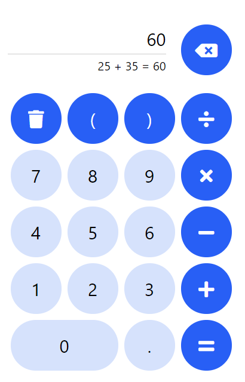

# Calculator React Native

<p>
  
  
  
</p>

This is Calculator App based on React Native framework and TypeScript language.



## Web site

### https://calc.ya-erm.ru

Used GitHub Pages to host web site result and GitHub Actions [pipeline.yml](.github/workflows/pipeline.yml) to automatically deploy.

## Expo

Project page: https://expo.dev/@ya-erm/Calculator

Expo link: [exp://exp.host/@ya-erm/Calculator](exp://exp.host/@ya-erm/Calculator)

---

## Development Guide

Install packages:
```sh
yarn
```

Run in development mode:
```sh
yarn start
```

See [package.json](./package.json) for more scripts
